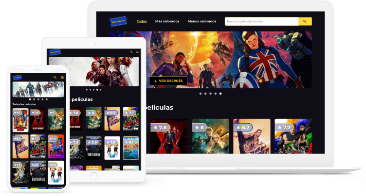

<h1 align="center">Pagina web - Block master con React</h1>

<div align="center">
  Solución del sitio web Block master con React
</div>

<div align="center">
  <h3>
    <a href="https://block-master-app-cse.netlify.app/">
      Demo
    </a>
    <span> | </span>
    <a href="https://github.com/carlossantesp/block-master-app">
      Solución
    </a>
    <span> | </span>
    <a href="leonidasesteban.com/proyectos/block-master">
      Diseño del proyecto
    </a>
  </h3>
</div>

## Tabla de contenido

- [Información](#información)
- [Desarrollado con](#desarrollado-con)
- [Agradecimiento](#agradecimiento)
- [Instalación](#instalación)
- [Contacto](#contacto)

## Información



Block Master es la plataforma de contenido más reciente en el mercado pero a la vez la más potente. Revisa el demo [aquí](https://block-master-app-cse.netlify.app/)

## Desarrollado con

- [React](https://es.reactjs.org/docs/getting-started.html)
- [Styled components](https://styled-components.com/docs)
- [Redux](https://es.redux.js.org/)
- [Api Themoviedb](https://www.themoviedb.org/?language=es)

## Agradecimiento

Este proyecto y muchos más lo puedes encontrar en [leonidasesteban.com/proyectos](https://leonidasesteban.com/proyectos).

## Instalación

- Descargar el repositorio
  ```bash
  $ git clone https://github.com/carlossantesp/block-master-app.git
  ```
- Instalar las dependecias

  **NPM**
  ```bash
  $ npm install
  ```

  **YARN**
  ```bash
  $ yarn install
  ```
- Ejecutar servidor de desarrollo

  **NPM**
  ```bash
  $ npm run dev
  ```

  **YARN**
  ```bash
  $ yarn dev
  ```
- Construir sitio web para el deploy

  **NPM**
  ```bash
  $ npm run build
  ```

  **YARN**
  ```bash
  $ yarn build
  ```
- Copiar y renombrar el archivo `.env-example` por `.env` y cambiar las variables de entorno

  ```
  VITE_MOVIE_API_KEY=YOUR_API_KEY_THEMOVIEDB
  VITE_MOVIE_URL=https://api.themoviedb.org
  VITE_VERSION_MOVIE=3
  ```
  > Debe cambiar `YOUR_API_KEY_THEMOVIEDB` por su API key proporcionado por la api [themoviedb](https://www.themoviedb.org/?language=es)
## Contacto

- Portafolio web [carlos.santillan.dev](https://carlos.santillan.dev)
- GitHub [@carlossantesp](https://github.com/carlossantesp)
- Linkedin [@dev-santillan-carlos](https://www.linkedin.com/in/dev-santillan-carlos)